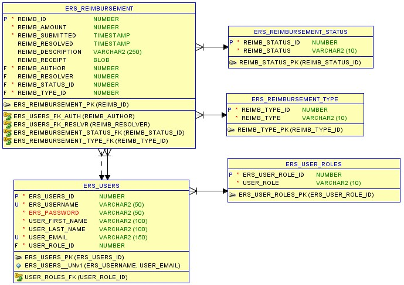

README.md
# Employee Reimbursment System (ERS)

## Executive Summary
The Expense Reimbursement System (ERS) will manage the process of reimbursing employees for expenses incurred while on company time. All employees in the company can login and submit requests for reimbursement and view their past tickets and pending requests. Finance managers can log in and view all reimbursement requests and past history for all employees in the company. Finance managers are authorized to approve and deny requests for expense reimbursement.

## Technologies Used
Backend:
Java
PostgreSQL
Maven
JUnit
Log4j
Tomcat

Frontend:
HTML
CSS
JavaScript

Cloud:
AWS RDS

Version Control:
Git

###Features
List of features ready and TODOs for future development

Automatic password encryption via the Blowfish algorithm.
JavaScript managed input boxes.
JavaScript managed displays and drop-down selectors.

###To-do list:

Wow improvement to be done 1
Wow improvement to be done 2

###Getting Started:
Copy the repository https url by pressing the green clone button, or copy the url.
Clone the repository by opening Git Bash at the desired location and running the clone command:
git clone <insert git url>
Open IDE (Spring Tool Suite) that can run a Java Maven project and import as an existing Maven project.
Run the application on a Tomcat 9 server.
Open Employee_Reimbursment_System.html from the HTML folder.

###Usage:
2 Employee logins are provided:
Employee Employee
Employee2 Employee2

Also 2 Manager login are provided:
Manager Manager
Manager2 Manager2

Once logged in, follow the menu given.

###Reimbursement Types / Manager Processing Types:
Available in drop-downs.  For the Manager Processing Types, 2 selections leave the ticket open and 2 close the request.
------------------------------------------------------------------------------------------------------------------------------------

# Employee Reimbursment System (ERS)

## Executive Summary
The Expense Reimbursement System (ERS) will manage the process of reimbursing employees for expenses incurred while on company time. All employees in the company can login and submit requests for reimbursement and view their past tickets and pending requests. Finance managers can log in and view all reimbursement requests and past history for all employees in the company. Finance managers are authorized to approve and deny requests for expense reimbursement.

**State-chart Diagram (Reimbursement Statuses)** 

**Reimbursement Types**

Employees must select the type of reimbursement as: LODGING, TRAVEL, FOOD, or OTHER.

**Logical Model**

**Physical Model**

**Use Case Diagram**

**Activity Diagram**

## Technical Requirements

The back-end system shall use JDBC to connect to a Postgres database. The application shall deploy onto a Tomcat Server. The middle tier shall use Servlet technology for dynamic Web application development. The front-end view shall use HTML/CSS/JavaScript to make an application that can call server-side components in a generally RESTful manner. Passwords shall be encrypted in Java and securely stored in the database. The middle tier shall follow proper layered architecture, have reasonable (~70%) test coverage of the service layer, and implement log4j for appropriate logging. Webpages shall be styled to be functional and readable. 

**Stretch Goals:**
* Replace JDBC with Hibernate to manage the database connection.
* Users can upload a document or image of their receipt when submitting reimbursements which can stored in the database and reviewed by a financial manager.
* Postgres Database shall be hosted remotely on an AWS RDS. 
* Java application shall be hosted remotely on an EC2.
* Static files (webpages) shall be hosted on an S3 bucket. 
